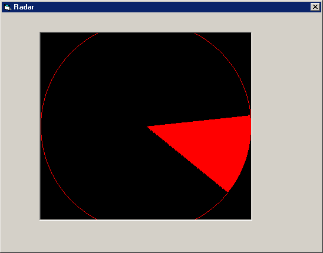



## Using Pi and Arcs for a Radar

### Description

Shows you how to use Pi for drawing Arcs(part of a circle) to use as a radar.
 
### More Info
 

             |
---                |---
**Submitted On**   |
**By**             |[Philip Salmony](https://github.com/Planet-Source-Code/PSCIndex/blob/master/ByAuthor/philip-salmony.md)
**Level**          |Intermediate
**User Rating**    |5.0 (15 globes from 3 users)
**Compatibility**  |VB 6\.0
**Category**       |[Graphics](https://github.com/Planet-Source-Code/PSCIndex/blob/master/ByCategory/graphics__1-46.md)
**World**          |[Visual Basic](https://github.com/Planet-Source-Code/PSCIndex/blob/master/ByWorld/visual-basic.md)
**Archive File**   |

### Source Code

<H1>Using Pi and Arcs for a Radar</H1>
  
Hi, I'm Philip and I'm going to show you to how to make a great radar for games or other stuff.  So...the first thing you need to know is what Pi is ! Pi is a number to calculate stuff with circles. Pi goes on for EVER !!! But of course we only need a few digits :

Pi = 3.14159265358979 (we need a double data type for that!)

You will need to put a Timer (called RadarSearcher) and a PictureBox (called
RadarBox) on the Form .So now we need to declare the globals (Pi and the Arcsize(in degrees)). So just type this
in :

 

'Globals for radar Const PI  As Double = 3.14159265358979
'We need Pi for calculating where the arc should be and at
what angle Const ARCSIZE As Integer = 45
 'Lets take an arc of 45 degrees size

Then we need to create the sub for the Timer. This is the main part (the
core) of the program which calculates and displays the radar. Once you've typed
the next block of code in set the Enabled property of the Timer to true (which
is actually the defaut, but just making sure) and the Interval property of the
Timer to 100. Having the Interval property at 100 makes the Radar look
smooth-running. If you want to you can set the Interval property to 1000 and see
what happens. So enough of the boring stuff... Let's get down to business :

'Timer Sub for calculating and displaying the radar

Private Sub RadarSearch_Timer()  'The main Timer (Interval set 100 is
standard) 

Dim X  As Integer, Y  As
Integer, r  As Integer 'X
and Y Coordinates of the Arc 

  Dim ArcStart  As Single, ArcEnd As Single
'The beginning position of the Arc (in degrees) 

  Dim nCount  As Integer 'Main
loop variable (used to move the arc) 

'Make sure that the forecolor is vbRed and the backcolor is vbBlack ! I tried
using a different color combination and it didn't display anything !!!
 RadarBox.FillColor = vbRed
 RadarBox.BackColor = vbBlack
'The
next 3 lines make the arc fit into the PictureBox perfectly
 
 X = RadarBox.ScaleWidth - 4 
 Y = RadarBox.ScaleHeight - 4 
 r = X / 2
'The next 4 lines set the drawmode stuff and
draw a circle (NOT AN ARC) for the arc to move in
 
 RadarBox.DrawWidth = 1 
 RadarBox.DrawMode = vbCopyPen 
 RadarBox.FillStyle = vbFSTransparent 
 RadarBox.Circle (X / 2 + 2, Y / 2 + 2), r 

'These next 2 lines also do some drawmode
stuff
 
 RadarBox.DrawMode = vbXorPen 
 RadarBox.FillStyle = vbSolid 

'Now... the big one ! This rotates and draws the arc 1
full rotation.
 

 For nCount = 0  To 360 
&nbsp;&nbsp;&nbsp; ArcStart = nCount 
&nbsp;&nbsp;&nbsp; ArcEnd = nCount + ARCSIZE 
&nbsp;&nbsp;&nbsp;&nbsp;&nbsp;&nbsp;&nbsp; If ArcEnd > 360
 Then ArcEnd = ArcEnd - 360 
&nbsp;&nbsp;&nbsp;&nbsp;&nbsp;&nbsp;&nbsp;&nbsp;&nbsp;&nbsp;&nbsp; RadarBox.Circle ((X / 2) + 2, (Y / 2) + 2), r, , -ArcStart * PI / 180, -ArcEnd * PI / 180 
&nbsp;&nbsp;&nbsp;&nbsp;&nbsp;&nbsp;&nbsp;&nbsp;&nbsp;&nbsp;&nbsp; DoEvents 
&nbsp;&nbsp;&nbsp;&nbsp;&nbsp;&nbsp;&nbsp;&nbsp;&nbsp;&nbsp;&nbsp; RadarBox.Circle ((X / 2) + 2, (Y / 2) + 2), r, , -ArcStart * PI / 180, -ArcEnd * PI / 180 

 Next nCount 
 

End Sub

&nbsp;

I really hope you liked this tutorial. If you did please vote for me.

Philip

